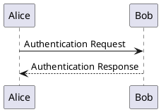

# Workflow
Below is the order of steps to follow when working with LangGraph:
### Scrape Content

```python
from langgraph.graph import START

graph.add_edge(START, "scrape_node")
```


# Knowledge

- `Nodes`: Python functions that encode the logic of your agents. They receive the current `State` as input, perform some 
computation or side-effect, and return an updated State.
- `Edges`: Python functions that determine which `Node` to execute next based on the current `State`. They can be 
conditional branches or fixed transitions.

In short: nodes do the work. edges tell what to do next.

### State
The State consists of the schema of the graph as well as reducer functions which specify how to apply updates to the 
state. All Nodes will emit updates to the State which are then applied using the specified reducer function.

### Reducers
```python
from typing_extensions import TypedDict

class State(TypedDict):
    foo: int
    bar: list[str]
```

In this example, no reducer functions are specified for any key. Let's assume the input to the graph 
is `{"foo": 1, "bar": ["hi"]}`. Let's then assume the first Node returns `{"foo": 2}`. This is treated as an update 
to the state. Notice that the Node does not need to return the whole State schema - just an update. After applying 
this update, the State would then be `{"foo": 2, "bar": ["hi"]}`. If the second node returns `{"bar": ["bye"]}` then 
the State would then be `{"foo": 2, "bar": ["bye"]}`

### Message Passing
When a Node completes its operation, it sends messages along one or more edges to other node(s). These recipient nodes 
then execute their functions, pass the resulting messages to the next set of nodes, and the process continues.


### Messages
Messages are the unit of communication in chat models. They are used to represent the input and output of a chat model, 
as well as any additional context or metadata that may be associated with a conversation.

A message typically consists of the following pieces of information:
- Role: The role of the message (e.g., "user", "assistant").
- Content: The content of the message (e.g., text, multimodal data).
- Additional metadata: id, name, token usage and other model-specific metadata.

The five main message types are:
- SystemMessage: corresponds to system role
- HumanMessage: corresponds to user role
- AIMessage: corresponds to assistant role
- AIMessageChunk: corresponds to assistant role, used for streaming responses
- ToolMessage: corresponds to tool role

### Edges
There are a few key types of edges:
- Normal Edges: Go directly from one node to the next.
- Conditional Edges: Call a function to determine which node(s) to go to next.
- Entry Point: Which node to call first when user input arrives.
- Conditional Entry Point: Call a function to determine which node(s) to call first when user input arrives.
A node can have MULTIPLE outgoing edges. If a node has multiple out-going edges, all of those destination nodes will be 
executed in parallel as a part of the next superstep.


### Send
By default, Nodes and Edges are defined ahead of time and operate on the same shared state. However, there can be cases 
where the exact edges are not known ahead of time and/or you may want different versions of State to exist at the same 
time. 

To support this design pattern, LangGraph supports returning Send objects from conditional edges. Send takes two 
arguments: first is the name of the node, and second is the state to pass to that node.

```python
def continue_to_jokes(state: OverallState):
    return [Send("generate_joke", {"subject": s}) for s in state['subjects']]

graph.add_conditional_edges("node_a", continue_to_jokes)
```

### Command


# Test diagrams



